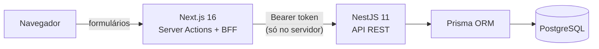
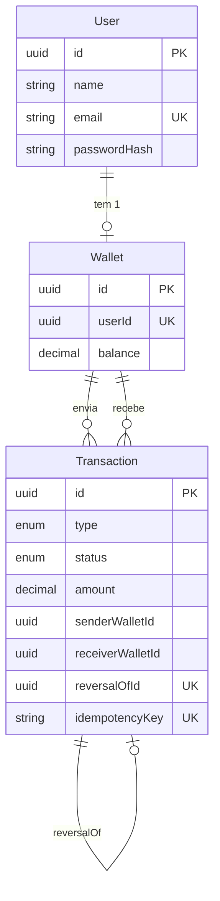
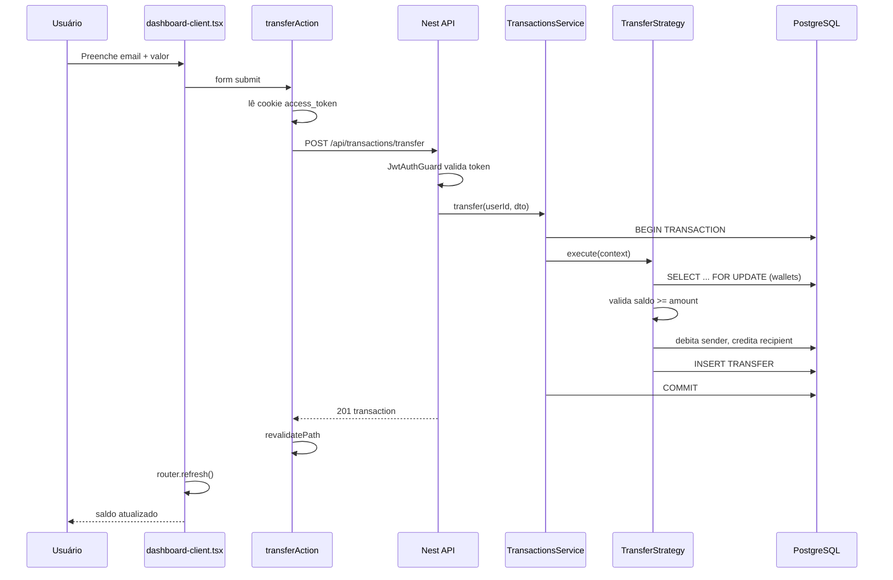

# Guia de Estudo — Carteira Financeira (Engenharia Reversa)

Este guia foi montado para você **entender e explicar** o projeto no code review, não só "rodar". Leia na ordem sugerida.

### Estudo módulo a módulo (aprofundado)

| Módulo | Arquivo | Status |
|--------|---------|--------|
| **Auth + JWT + Refresh Token** | [ESTUDO-AUTH-TOKENS.md](./ESTUDO-AUTH-TOKENS.md) | Disponível |
| Transações (strategies, lock, ledger) | — | Em breve |

---

## 1. Visão geral: o que o desafio pediu vs o que entregamos

| Requisito do desafio | Onde está no código | Como explicar em 1 frase |
|----------------------|---------------------|--------------------------|
| Cadastro | `AuthService.register()` + `AuthController` | Cria usuário + wallet com saldo 0 na mesma transação |
| Autenticação | JWT + argon2 + cookies httpOnly no Next | API gera tokens; frontend guarda em cookie seguro |
| Depositar | `DepositStrategy` | Soma valor ao saldo, mesmo se negativo |
| Transferir | `TransferStrategy` | Valida saldo, debita remetente, credita destinatário |
| Receber | Automático na transferência | Destinatário recebe crédito na wallet dele |
| Validar saldo antes de transferir | `TransferStrategy` | Bloqueia se `balance < amount` |
| Depósito soma mesmo com saldo negativo | `updateBalance` usa `increment` sem trava em zero | Não há "piso" no saldo |
| Reversão | `ReversalStrategy` | Cria transação compensatória, não apaga a original |
| Docker | `docker-compose.yml` | Postgres containerizado |
| Testes unitários | `*.spec.ts` | 8 testes mockando repositórios |
| Testes integração | `test/app.e2e-spec.ts` | 9 testes fluxo completo |
| Documentação | `README.md` + Swagger | `/api/docs` |
| Observabilidade | `LoggingInterceptor` + `/api/health` | Correlation ID + health check |
| Server Actions | `wallet.actions.ts` | Mutações via Next.js server, não API routes |

---

## 2. Arquitetura em 30 segundos (memorize isso)



**Frase para a entrevista:**

> "Separei frontend (Next.js) e backend (NestJS) porque o desafio pedia ambos. O Next atua como BFF: Server Actions chamam a API e guardam JWT em cookies httpOnly. O Nest concentra regras de negócio, validações e persistência."

---

## 3. Estrutura de pastas — mapa completo

```
desafio-adriano-cobuccio/
├── .env                    ← variáveis (DATABASE_URL, JWT secrets, portas)
├── docker-compose.yml      ← Postgres (porta 5433 no host)
├── pnpm-workspace.yaml     ← monorepo: apps/api + apps/web
├── README.md
│
├── apps/api/               ← BACKEND (NestJS)
│   ├── prisma/
│   │   └── schema.prisma   ← modelagem: User, Wallet, Transaction
│   ├── scripts/
│   │   └── prisma-with-env.js  ← carrega .env da raiz pro Prisma CLI
│   ├── src/
│   │   ├── main.ts         ← bootstrap da API
│   │   ├── load-env.ts     ← carrega .env antes do Nest iniciar
│   │   ├── app.module.ts   ← módulo raiz
│   │   │
│   │   ├── auth/           ← cadastro + login + JWT
│   │   ├── wallet/         ← consulta de saldo
│   │   ├── transactions/   ← depósito, transferência, reversão
│   │   ├── health/         ← health check
│   │   ├── prisma/         ← conexão com banco
│   │   └── common/         ← guards, filters, exceptions, decorators
│   │
│   └── test/
│       └── app.e2e-spec.ts ← teste integração ponta a ponta
│
└── apps/web/               ← FRONTEND (Next.js)
    └── src/
        ├── middleware.ts           ← protege /dashboard
        ├── lib/
        │   ├── api.ts              ← fetch para Nest API
        │   └── auth-cookies.ts     ← cookies httpOnly
        └── app/
            ├── page.tsx            ← landing
            ├── login/page.tsx
            ├── register/page.tsx
            ├── dashboard/
            │   ├── page.tsx        ← Server Component (dados)
            │   └── dashboard-client.tsx  ← Client Component (forms)
            └── actions/
                └── wallet.actions.ts  ← Server Actions (coração do front)
```

---

## 4. Modelagem de dados (o coração financeiro)

Três tabelas principais em `apps/api/prisma/schema.prisma`:



### Conceitos-chave para explicar

**1. Ledger append-only (livro-razão)**

- Transações **nunca são deletadas**
- Reversão = nova linha `REVERSAL`, original vira `REVERSED`
- Audit trail completo

**2. Saldo negativo permitido**

- `balance` usa `increment`/`decrement` sem clamping
- Cenário: reversão de transferência quando destinatário já gastou

**3. `idempotencyKey`**

- Evita duplo clique gerar 2 transferências iguais
- Unique no banco

**4. `reversalOfId` unique**

- Uma transação só pode ser revertida **uma vez**

---

## 5. Camadas do backend (NestJS) — padrão por módulo

Cada feature segue a mesma estrutura:

```
Controller  →  Service  →  Strategy  →  Repository  →  Prisma  →  PostgreSQL
   ↑              ↑
  DTO         regras de negócio
 validação
```

### Módulos

| Módulo | Responsabilidade | Arquivos principais |
|--------|------------------|---------------------|
| `auth` | Cadastro, login, JWT | `auth.controller.ts`, `auth.service.ts`, `jwt.strategy.ts` |
| `wallet` | Consultar saldo | `wallet.controller.ts`, `wallet.service.ts` |
| `transactions` | Operações financeiras | `transactions.service.ts` + 3 strategies |
| `common` | Infra transversal | guards, filters, exceptions |
| `health` | Monitoramento | `/api/health` |

---

## 6. Fluxos completos — passo a passo

### 6.1 Cadastro (`POST /api/auth/register`)

```
1. Browser → formulário /register
2. registerAction (Server Action) valida com Zod
3. apiRequest → POST /api/auth/register
4. AuthController.register(RegisterDto)
5. AuthService.register():
   - findByEmail → se existe: EmailAlreadyExistsException (409)
   - argon2.hash(senha)
   - prisma.$transaction:
       user.create(...)
       wallet.create(balance: 0)
   - generateTokens() → access + refresh JWT
6. setAuthCookies() no Next
7. redirect('/dashboard')
```

**O que dizer:** "Cadastro e criação da wallet são atômicos — ou cria os dois ou nenhum."

---

### 6.2 Login (`POST /api/auth/login`)

```
1. loginAction → POST /api/auth/login
2. AuthService.login():
   - findByEmail → se não existe: InvalidCredentialsException
   - argon2.verify(hash, senha) → se falha: InvalidCredentialsException
   - generateTokens()
3. Cookies httpOnly + redirect dashboard
```

**Segurança:** mensagem genérica "Invalid email or password" — não revela se email existe.

---

### 6.3 Depósito (`POST /api/transactions/deposit`)

```
1. depositAction → POST /api/transactions/deposit
2. JwtAuthGuard valida Bearer token
3. TransactionsService.deposit():
   - se idempotencyKey já existe → retorna transação existente
   - getWalletByUserId()
   - prisma.$transaction → DepositStrategy.execute():
       a) lockById(wallet)        ← SELECT ... FOR UPDATE
       b) updateBalance(+amount)  ← increment, funciona mesmo se saldo negativo
       c) create(DEPOSIT)
4. revalidatePath('/dashboard')
5. router.refresh() atualiza saldo na tela
```

**Requisito atendido:** depósito **sempre soma**, nunca bloqueia por saldo negativo.

---

### 6.4 Transferência (`POST /api/transactions/transfer`)

```
1. transferAction → POST /api/transactions/transfer
2. TransactionsService.transfer():
   - idempotency check
   - getWalletByUserId (remetente)
   - findByEmail (destinatário)
   - prisma.$transaction → TransferStrategy.execute():
       a) lockById(sender) + lockById(recipient)
       b) if sender.balance < amount → InsufficientBalanceException
       c) updateBalance(sender, -amount)
       d) updateBalance(recipient, +amount)
       e) create(TRANSFER)
```

**Requisito atendido:** valida saldo **antes** de debitar.

**Concorrência:** lock pessimista evita double-spend se 2 transferências simultâneas.

---

### 6.5 Reversão (`POST /api/transactions/:id/reverse`)

```
1. reverseTransactionAction(id)
2. TransactionsService.reverse():
   - findById(transaction)
   - prisma.$transaction → ReversalStrategy.execute():
       a) se type=REVERSAL → InvalidTransactionTypeException
       b) se status=REVERSED → TransactionAlreadyReversedException
       c) se userId não é sender nem receiver → UnauthorizedTransactionAccessException
       d) inverte saldos (DEPOSIT ou TRANSFER)
       e) create(REVERSAL, reversalOfId=original.id)
       f) markAsReversed(original) → status=REVERSED
```

**Requisito atendido:** reversão por solicitação do usuário, sem apagar histórico.

---

## 7. Design patterns e SOLID — o que falar no code review

### Strategy Pattern

**Onde:** `DepositStrategy`, `TransferStrategy`, `ReversalStrategy`

**Por quê:** cada tipo de operação tem regras diferentes. O `TransactionsService` só orquestra — não conhece detalhes de cada operação.

**Frase:** "Usei Strategy para respeitar o Open/Closed: adicionar um novo tipo de transação sem alterar o service existente."

---

### Repository Pattern

**Onde:** `IWalletRepository`, `ITransactionRepository`, `IAuthRepository`

**Por quê:** Service depende de **interface**, não de Prisma diretamente.

**Frase:** "Repository + Dependency Inversion facilitam testes unitários com mocks e desacoplam a regra de negócio do ORM."

---

### SOLID no projeto

| Princípio | Exemplo no código |
|-----------|-------------------|
| **S** Single Responsibility | Controller só recebe HTTP; Service só regra; Repository só persistência |
| **O** Open/Closed | Strategies extensíveis sem mudar TransactionsService |
| **L** Liskov | Strategies implementam `ITransactionStrategy` |
| **I** Interface Segregation | Interfaces pequenas por domínio (wallet, transaction, auth) |
| **D** Dependency Inversion | `@Inject(WALLET_REPOSITORY)` injeta interface, não classe concreta |

---

## 8. Segurança — checklist para a entrevista

| Medida | Onde | Por quê |
|--------|------|---------|
| argon2 | `auth.service.ts` | Hash de senha recomendado pela OWASP |
| JWT access (15min) + refresh (7d) | `auth.service.ts` | Token curto reduz janela de ataque |
| Refresh automático | `middleware.ts` + `api.ts` | Renova a sessão sem expor tokens ao browser |
| Cookies httpOnly | `auth-cookies.ts` | JS do browser não acessa token (anti-XSS) |
| BFF pattern | Server Actions | Token nunca vai pro localStorage |
| JwtAuthGuard | rotas protegidas | Só usuário autenticado opera wallet |
| Rate limiting | Throttler + `@Throttle` em login/register | Anti brute-force |
| Helmet | `main.ts` | Headers HTTP seguros |
| CORS restrito | `main.ts` | Só frontend autorizado |
| ValidationPipe whitelist | global | Rejeita campos extras no body |
| Autorização por recurso | `ReversalStrategy` | Só participantes revertem |
| Lock pessimista | `WalletRepository.lockById` | Integridade financeira |

**Como explicar o refresh automático:** o `middleware` verifica se o `access_token` está ausente, expirado ou perto de expirar ao acessar `/dashboard`. Se houver `refresh_token`, ele chama `/api/auth/refresh`, grava novos cookies httpOnly e deixa a navegação continuar. Para mutações via Server Actions, `apiRequest` também tenta renovar e repetir a chamada se a API retornar `401`.

---

## 9. Frontend — como funciona (Next.js)

### Server Actions (diferencial do desafio)

Tudo em `apps/web/src/app/actions/wallet.actions.ts`:

| Action | O que faz |
|--------|-----------|
| `registerAction` | cadastro + cookies + redirect |
| `loginAction` | login + cookies + redirect |
| `logoutAction` | limpa cookies + redirect |
| `getBalanceAction` | GET saldo |
| `getTransactionsAction` | GET histórico |
| `depositAction` | POST depósito |
| `transferAction` | POST transferência |
| `reverseTransactionAction` | POST reversão |

**Frase:** "Usei Server Actions porque mutações rodam no servidor Next, sem expor tokens ao client e sem criar API routes redundantes."

### Middleware (`middleware.ts`)

- `/dashboard` sem cookie → redireciona `/login`
- `/login` ou `/register` com cookie → redireciona `/dashboard`

### Dashboard híbrido

- `dashboard/page.tsx` — **Server Component**: busca dados no servidor
- `dashboard-client.tsx` — **Client Component**: formulários interativos

---

## 10. Testes — o que cobrem

### Unitários (8 testes)

- `auth.service.spec.ts` — register, login, email duplicado, credenciais inválidas
- `transactions.service.spec.ts` — deposit, idempotency, saldo insuficiente, reversão

**Técnica:** mockam repositórios/strategies — testam **regra de orquestração**, não banco.

### Integração e2e (9 testes)

Fluxo completo em `test/app.e2e-spec.ts`:

```
register user1 → register user2 → deposit 200 → balance 200
→ transfer 50 → transfer 9999 (falha) → reverse → balances restaurados
```

---

## 11. Roteiro de estudo (7 dias sugeridos)

### Dia 1 — Entender o todo

1. Leia este guia inteiro
2. Rode o projeto (`docker compose up postgres -d` + `pnpm dev`)
3. Teste manualmente: cadastro → depósito → transferência → reversão
4. Abra Swagger: http://localhost:3001/api/docs

### Dia 2 — Banco e modelagem

1. Leia `schema.prisma` linha por linha
2. No Swagger ou pgAdmin, veja as tabelas após operações
3. Entenda: por que `REVERSAL` em vez de DELETE?

### Dia 3 — Backend auth

1. Leia na ordem: `auth.controller.ts` → `auth.service.ts` → `jwt.strategy.ts`
2. Trace o fluxo de register no código
3. Explique argon2 e JWT em voz alta

### Dia 4 — Backend transações

1. Leia `transactions.service.ts`
2. Leia as 3 strategies na ordem: deposit → transfer → reversal
3. Leia `wallet.repository.ts` (lock + increment)
4. Explique Strategy + lock pessimista

### Dia 5 — Frontend

1. Leia `wallet.actions.ts` (todas as actions)
2. Leia `middleware.ts` + `auth-cookies.ts`
3. Leia `dashboard/page.tsx` + `dashboard-client.tsx`
4. Explique BFF + Server Actions

### Dia 6 — Testes e infra

1. Rode `pnpm test` e `pnpm test:e2e`
2. Leia os arquivos `.spec.ts` e `app.e2e-spec.ts`
3. Leia `docker-compose.yml` e `.env`

### Dia 7 — Ensaio da entrevista

Pratique responder as 10 perguntas da seção 12 em voz alta.

---

## 12. Perguntas que vão cair + respostas modelo

**1. Por que NestJS + Next.js separados?**

> Nest expõe API REST testável e documentada (Swagger). Next entrega UI e atua como BFF com Server Actions, protegendo JWT em cookies httpOnly.

**2. Por que PostgreSQL e Prisma Decimal?**

> Operações financeiras exigem ACID e precisão. Float causaria erro de arredondamento; Decimal garante centavos corretos.

**3. Como garante que duas transferências simultâneas não gastem o mesmo saldo?**

> `prisma.$transaction` + `SELECT ... FOR UPDATE` trava a linha da wallet antes de debitar.

**4. Como funciona a reversão?**

> Não apago a transação. Crio uma `REVERSAL` que desfaz os saldos e marco a original como `REVERSED`. Histórico preservado.

**5. E se o saldo ficar negativo?**

> Proposital. O requisito diz que depósito soma ao valor atual. Reversão de transferência pode deixar saldo negativo se o destinatário já gastou.

**6. O que é idempotencyKey?**

> Chave única por operação. Se o usuário clica 2x no botão, a segunda request retorna a mesma transação em vez de duplicar.

**7. Por que Strategy pattern?**

> Depósito, transferência e reversão têm regras distintas. Strategy permite estender sem modificar o TransactionsService (Open/Closed).

**8. Como protege o JWT?**

> Nunca vai pro localStorage. Next guarda em cookie httpOnly; só Server Actions leem e enviam Bearer pra API.

**9. O que falta / próximos passos?**

> Observabilidade completa (OpenTelemetry), CI/CD, rotação persistida de refresh token com blacklist e notificações em tempo real.

**10. Por que monorepo com pnpm?**

> Um lockfile, dependências deduplicadas, scripts centralizados (`pnpm dev`, `pnpm test`). `node_modules` na raiz é o armazém; cada app tem symlinks pros pacotes que usa.

---

## 13. Ordem de leitura dos arquivos (checklist)

Marque conforme for lendo:

**Infra**

- [ ] `.env.example`
- [ ] `docker-compose.yml`
- [ ] `pnpm-workspace.yaml`

**Banco**

- [ ] `apps/api/prisma/schema.prisma`

**Backend — bootstrap**

- [ ] `apps/api/src/main.ts`
- [ ] `apps/api/src/app.module.ts`
- [ ] `apps/api/src/load-env.ts`

**Backend — auth**

- [ ] `auth.controller.ts`
- [ ] `auth.service.ts`
- [ ] `jwt.strategy.ts`
- [ ] `auth/dto/auth.dto.ts`

**Backend — transações**

- [ ] `transactions.controller.ts`
- [ ] `transactions.service.ts`
- [ ] `strategies/deposit.strategy.ts`
- [ ] `strategies/transfer.strategy.ts`
- [ ] `strategies/reversal.strategy.ts`
- [ ] `wallet/repositories/wallet.repository.ts`

**Backend — cross-cutting**

- [ ] `common/filters/global-exception.filter.ts`
- [ ] `common/exceptions/business.exceptions.ts`
- [ ] `common/guards/jwt-auth.guard.ts`
- [ ] `common/interceptors/logging.interceptor.ts`

**Frontend**

- [ ] `app/actions/wallet.actions.ts`
- [ ] `lib/api.ts`
- [ ] `lib/auth-cookies.ts`
- [ ] `middleware.ts`
- [ ] `dashboard/page.tsx`
- [ ] `dashboard/dashboard-client.tsx`

**Testes**

- [ ] `auth.service.spec.ts`
- [ ] `transactions.service.spec.ts`
- [ ] `test/app.e2e-spec.ts`

---

## 14. Diagrama final — fluxo de uma transferência (memorize)



---

## 15. Como rodar do zero (referência rápida)

```powershell
cd "C:\Users\ricks\OneDrive\Documentos\desafio-adriano-cobuccio"
Copy-Item .env.example .env          # só na primeira vez
pnpm install
docker compose up postgres -d
pnpm db:generate
pnpm db:migrate:dev
pnpm dev
```

| URL | Endereço |
|-----|----------|
| App | http://localhost:3000 |
| Swagger | http://localhost:3001/api/docs |
| Health | http://localhost:3001/api/health |
